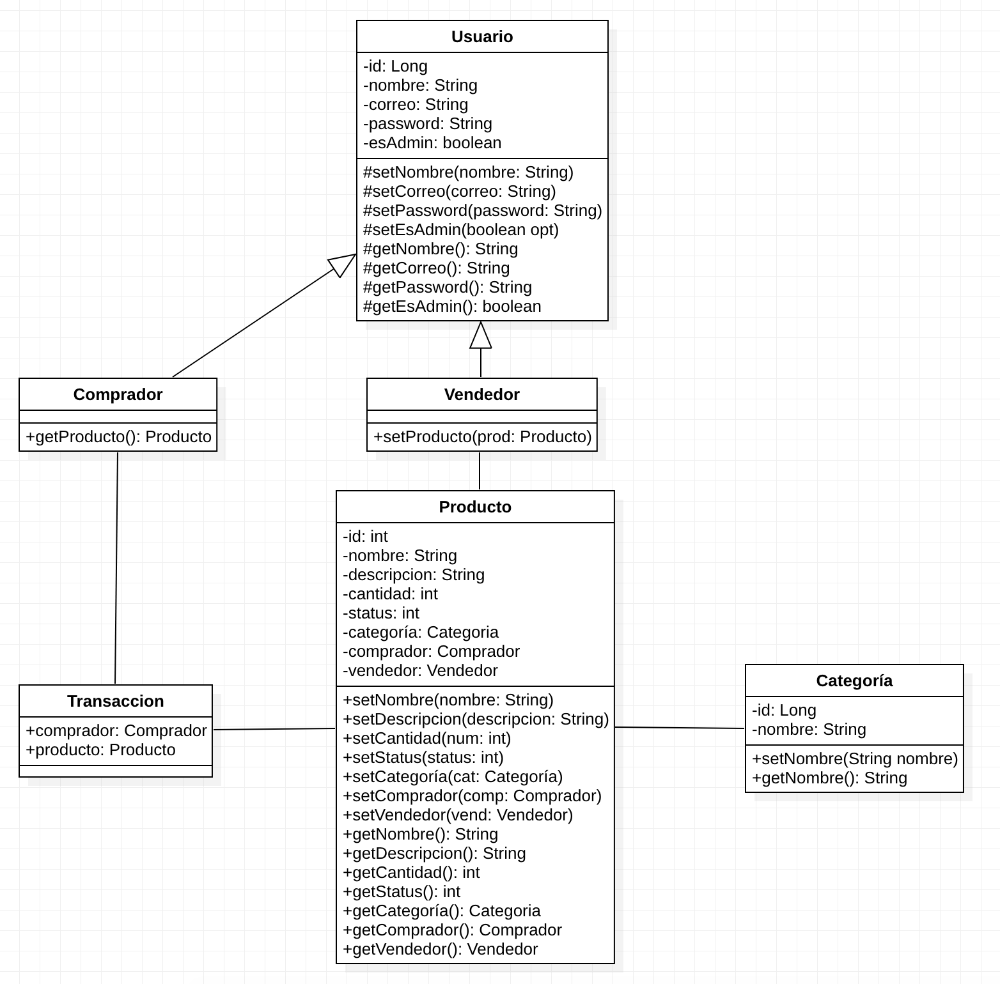

---
#### **Desafío 2 - Sistema de compras y ventas en línea**
---

<p style="text-align: justify;">
En el siguiente desafío, tendremos la oportunidad de poder desarrollar la base del código para un sistema de compras y ventas online, tomando en cuenta los siguientes puntos:
</p>

* El usuario del sistema consta de los siguientes atributos: id, nombre, correo, esAdmin, password.
* Los productos poseen los siguientes atributos: id, nombre, descripcion, cantidad, status y poseen una categoría.
* Un usuario puede ser vendedor y además ser comprador.
* Los compradores realizan transacciones y los vendedores realizan el seteo de productos.

__Se deben realizar las siguientes tareas:__

* Listar las clases que modelan el problema.
* Crear el diagrama de clases con la información reunida, con sus atributos y operaciones.
* Crear el código en Java que represente a estas clases.
* Crear una aplicación que cree un vendedor y liste sus atributos.

---
#### **Solución**
---
__Listar las clases que modelan el problema.__

* Comprador.
* Vendedor.
* Usuario.
* Transaccion.
* Categoría.

__Crear el diagrama de clases con la información reunida, con sus atributos y operaciones.__
&nbsp;
<center></center>
&nbsp;

__Crear el código en Java que represente a estas clases.__

###### Clase Usuario:

```Java
package cl.desafiolatam.uml.desafio2;

public class Usuario {
    private Long id;
    private String nombre;
    private String correo;
    private String password;
    private boolean esAdmin;
    
	public Usuario(Long id, String nombre, String correo, String password, boolean esAdmin) {
		this.id = id;
		this.nombre = nombre;
		this.correo = correo;
		this.password = password;
		this.esAdmin = esAdmin;
	}

	protected Long getId() {
		return id;
	}

	protected void setId(Long id) {
		this.id = id;
	}

	protected String getNombre() {
		return nombre;
	}

	protected void setNombre(String nombre) {
		this.nombre = nombre;
	}

	protected String getCorreo() {
		return correo;
	}

	protected void setCorreo(String correo) {
		this.correo = correo;
	}

	protected String getPassword() {
		return password;
	}

	protected void setPassword(String password) {
		this.password = password;
	}

	protected boolean isEsAdmin() {
		return esAdmin;
	}

	protected void setEsAdmin(boolean esAdmin) {
		this.esAdmin = esAdmin;
	}

}

```

###### Clase Comprador:

```Java
package cl.desafiolatam.uml.desafio2;

public class Comprador extends Usuario{
	final Producto producto = new Producto();
	
	public Comprador(Long id, String nombre, String correo, String password, boolean esAdmin) {
        super(id, nombre, correo, password, esAdmin);
    }
	
	public Producto getProducto() {
        return this.producto;
    }

}

```
###### Clase Vendedor:

```Java
package cl.desafiolatam.uml.desafio2;

public class Vendedor extends Usuario {
	
	Producto producto;
	
	public Vendedor(Long id, String nombre, String correo, String password, boolean esAdmin) {
        super(id, nombre, correo, password, esAdmin);
    }
	
	public void setProducto(Producto prod) {
        this.producto = prod;
    }
	
}

```

###### Clase Transaccion:

```Java
package cl.desafiolatam.uml.desafio2

public class Transaccion {
    public Comprador comprador;
    public Producto producto;

}

```

###### Clase Categoria:

```Java
package cl.desafiolatam.uml.desafio2

public class Categoria {
    private Long id;
    private String nombre;

    public Categoria(Long id, String nombre){
        this id = id;
        this nombre = nombre;
    }

    public void setNombre(void String nombre) {
        this.nombre = nombre;
    }

    public String getNombre() {
        return this.nombre;
    }

}

```

###### Clase Producto:

```Java
package cl.desafiolatam.uml.desafio2;

public class Producto {
    private int id;
    private String nombre;
    private String descripcion;
    private int cantidad;
    private int status;
    private Categoria categoria;
    private Comprador comprador;
    private Vendedor vendedor;
	public Producto(int id, String nombre, String descripcion, int cantidad, int status, Categoria categoria,
			Comprador comprador, Vendedor vendedor) {
		super();
		this.id = id;
		this.nombre = nombre;
		this.descripcion = descripcion;
		this.cantidad = cantidad;
		this.status = status;
		this.categoria = categoria;
		this.comprador = comprador;
		this.vendedor = vendedor;
	}
	public int getId() {
		return id;
	}
	public void setId(int id) {
		this.id = id;
	}
	public String getNombre() {
		return nombre;
	}
	public void setNombre(String nombre) {
		this.nombre = nombre;
	}
	public String getDescripcion() {
		return descripcion;
	}
	public void setDescripcion(String descripcion) {
		this.descripcion = descripcion;
	}
	public int getCantidad() {
		return cantidad;
	}
	public void setCantidad(int cantidad) {
		this.cantidad = cantidad;
	}
	public int getStatus() {
		return status;
	}
	public void setStatus(int status) {
		this.status = status;
	}
	public Categoria getCategoria() {
		return categoria;
	}
	public void setCategoria(Categoria categoria) {
		this.categoria = categoria;
	}
	public Comprador getComprador() {
		return comprador;
	}
	public void setComprador(Comprador comprador) {
		this.comprador = comprador;
	}
	public Vendedor getVendedor() {
		return vendedor;
	}
	public void setVendedor(Vendedor vendedor) {
		this.vendedor = vendedor;
	}
	
	

}


```

__Crear una aplicación que cree un vendedor y liste sus atributos.__


```
package cl.desafiolatam.uml.desafio2;

public class Principal {
	
	public static void main(String[] args) {
		
		Vendedor vendedor1 = new Vendedor(1L, "Luis", "correo@fake.dev", "12345kl", true);
		
		System.out.println(vendedor1.getId().toString());
		System.out.println(vendedor1.getNombre());
		System.out.println(vendedor1.getCorreo());
		System.out.println(vendedor1.getPassword());
		System.out.println(vendedor1.isEsAdmin());
		

	}

}

```


