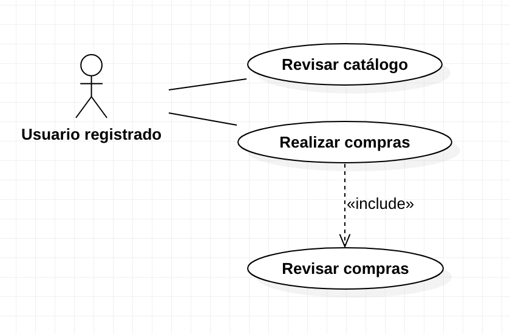

---
#### **Desafío 1 - Sistema de compras online**
---

Usted es el encargado del diseño de los requerimientos de la mejor startup, la cual se enfoca en el desarrollo de aplicaciones de compras online. En una reunión, a la que acaba de asistir, el cliente menciona los siguientes requerimientos para un sistema que quiere:

<ul>

  <li>El sistema posee tipos de usuario, el usuario registrado y un nuevo usuario.</li>

  <li>
    El nuevo usuario es aquel que visita el sitio sin estar registrado. Puede realizar las siguientes tareas:
    <ul>
      <li>Revisar el catálogo de compras.</li>
      <li>Registrarse.</li>
    </ul>
  </li>

  <li>
    Cuando el nuevo usuario se registra, pasa a ser un usuario registrado, este usuario puede realizar las siguietes tareas en el sistema:
      <ul>
        <li>Revisar el catálogo de compras.</li>
        <li>Realizar compras.</li>
    </ul>
  </li>

  <li>El cliente además nos indica que para tener una mejor claridad con los usuarios del sistema, estos manejan un solo usuario. El Cliente web, que es, básicamente, la unión de estos dos usuario.</li>
  <li>El cliente dispone de un servicio encargado de revisar que las transacciones de las compras y en caso que esta posea algún tipo de error, deberá comunicarlo.</li>

  <li>Adicional al servicio que se encarga de las transacciones de las compras, el cliente posee un servicio de autentificación. El cual maneja a los usuarios registrados.</li>

</ul>

Se le pide que como encangado, realice las siguietes tareas:

##### Primera parte: Diagrama de casos de uso.

* Reconocer y listar los casos de uso del sistema. 
* Reconocer y listar los actores que intervienen en el escenario.
* Realizar diagramas por separado que muestren cada uno de los actores y los casos de uso con los que interactúa.
* Realizar el diagrama de casos de uso que represente el escenario, utilizando toda la información que ha reunido hasta ahora.

#####  Segunda parte: Diagramas de secuencia.

* Se debe realizar el diagrama de secuencia, que muestre el flujo normal de la aplicación.
* Se deben realizar los diagramas de secuencia que nos muestre los siguientes flujos alternativos: El nuevo cliente intenta realizar una compra, el cliente registrado intenta registrarse, el cliente no posee saldo.

---
#### **Solución**
---
##### **Primera parte.**

__Reconocer y listar los casos de uso del sistema:__

* Revisar catálogo.
* Realizar compras.
* Revisar compras.
* Registrarse.

__Reconocer y listar los actores que intervienen en el escenario.__

* Usuario registrado.
* Usuario nuevo.
* Cliente web.
* Servicio de autentificación.
* Servicio de pago.

__Realizar diagramas por separado que muestren cada uno de los actores y los casos de uso con los que interactúa.__

&nbsp;

&nbsp;

&nbsp;

&nbsp;

&nbsp;

&nbsp;

__Realizar el diagrama de casos de uso que represente el escenario, utilizando toda la información que ha reunido hasta ahora.__

&nbsp;

&nbsp;

##### **Primera parte.**

__Se debe realizar el diagrama de secuencia, que muestre el flujo normal de la aplicación.__

&nbsp;

&nbsp;

__Se deben realizar los diagramas de secuencia que nos muestre los siguientes flujos alternativos: El nuevo cliente intenta realizar una compra, el cliente registrado intenta registrarse, el cliente no posee saldo.__

Flujo alternativo 1: El nuevo cliente intenta realizar una compra.

&nbsp;

&nbsp;

Flujo alternativo 2: El cliente registrado intenta registrarse
&nbsp;

&nbsp;

Flujo alternativo 2: El cliente no posee saldo.
&nbsp;

&nbsp;

