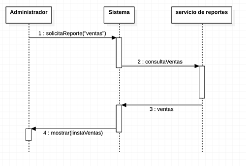
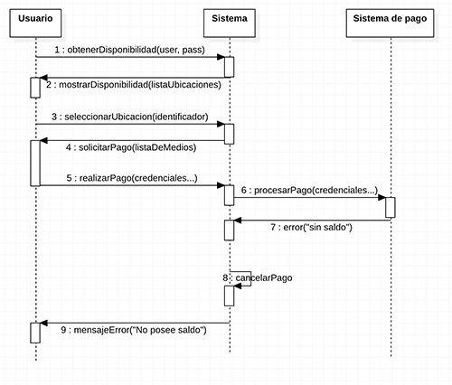

---
# LECTURA
---

## Componentes de la unidad
---

### **Nombre de la unidad**
* UML

### **Descripción unidad**
* En el capítulo de UML se conocerá el lenguaje de modelamiento unificado (UML), con el cual se aprenderá a crear casos de usos, diagramas de secuencias y diagramas de clases, para agilizar la creación de piezas de software.

### **Requerimientos**
* Conocimiento previo del paradigma de programación orientado a objetos.
* Tener una herramienta de modelado como [StarUml](http://staruml.io/download).

### **Referencias**

* UML distilled - Martin Fowler.
* El Lenguaje Unificado de Modelado - J. Rumbaugh, I. Jacobson, G. Booch.
* Ingeniería del software: un enfoque práctico séptima edición- Pressman · MC Graw-Hill
* [https://www.smartdraw.com/uml-diagram/](https://www.smartdraw.com/uml-diagram/)
* [https://ingenieriadesoftware.es/opiniones-lenguaje-uml-20-anos/](https://ingenieriadesoftware.es/opiniones-lenguaje-uml-20-anos/)
* [https://www.uml.org](https://www.uml.org)

### **Glosario**  

* __Agilidad__  

  Se refiere a la __flexibilidad__ que posee un proyecto, es decir, que pueda cambiar y que esto no produzca un alto impacto en el esfuerzo.

* __Aplicación__  

  Es un tipo de software que permite al usuario realizar uno o más tipos de trabajo.

* __Cliente__  

  En el contexto de la toma de requerimientos, es el ente que paga por el producto.

* __Framework__  

  Un marco de trabajo, o framework, es una estructura real o conceptual destinada a servir de soporte o guía para la construcción de algo que expande la estructura en algo útil. Para nuestro caso, es mejor que lo veamos como un software pre construido, al que le podemos ir adicionando piezas según sus reglas, con la finalidad obtener un producto personalizado a nuestras necesidades.

* __Granularidad__

  Representa el nivel de detalle con el que se desea modelar la información sobre el negocio que se esté analizando.

* __Metodología__  

  Grupo de mecanismos o procedimientos racionales, empleados para el logro de un objetivo.

* __Notación__  

  Es la acción y efecto de notar, hace referencia al sistema de signos convencionales que se adopta, para expresar algún concepto.

* __Paradigma__  

  Teoría o conjunto de teorías, cuyo núcleo central se acepta sin cuestionar y que suministra la base y modelo   para resolver problemas y avanzar en el conocimiento.

* __Patrón__  

  Hechos o cosas recurrentes. Estos se repiten con previsibilidad, por lo tanto, pueden funcionar como modelo para producir determinada cosa a partir de ellos.

* __Patrón de diseño de modelo-vista-controlador (MVC)__  

  Especifica que una aplicación consta de tres capas: La primera es el modelo de datos, que es la capa con la responsabilidad de la gestión de los datos, luego tenemos la capa de presentación, es lo que el usuario ve, es decir, la vista. La forma en que la información sea presentada al usuario, son responsabilidad de esta capa, por último, tenemos la capa del controlador, que es la capa encargada de orquestar o controlar, la interacción de las dos capas anteriormente mencionadas.

* __Programación declarativa__  

  Es un paradigma de la programación, en la que los programas se describen en términos de proposiciones y afirmaciones, que son __declaradas__, en donde los pasos para resolverlo, no impera. En este tipo de programación, nos encontraremos mucha recursividad.

* __Programación Funcional__  

  Es un paradigma que pertenece a la programación declarativa, basado en el trabajo de Alonzo Church y Stephen Kleene en la década de 1930, llamado: El Cálculo Lambda; este paradigma se compone de funciones que deben cumplir ciertas reglas (por ejemplo, que sean funciones puras). en donde encontraremos formas recursivas de por ejemplo, trabajar con arreglos como lo son: `map`, `reduce` o `filter`. La principal diferencia con la programación orientada a objetos, es que la programación funcional, no posee estados.

* __Programación Imperativa__:  

  En este paradigma de la programación, que, como su nombre lo indica, __imperan las instrucciones, condiciones o pasos__ indicamos exactamente, lo que el programa debe hacer. Típicamente nos encontraremos con estructuras cíclicas tales como: while, for. También condicionales if o switch. Lo que no quiere decir que si un programa posee estas instrucciones es puramente imperativo. Podemos reconocer este tipo de programación cuando leemos el código y su traza es una interpretación de lectura secuencial de lo que está escrito.

* __Programación Orientada a Objetos (POO)__  

  Este paradigma, es un tipo de programación imperativa, que mediante algunas técnicas (por ejemplo la herencia), resuelve algunas falencias que existían en la __programación procedural__ (por ejemplo la reutilización de código), utilizando objetos, cada uno de ellos, compuestos por un estado (datos) y un comportamiento.

* __Programación procedural__  

  Se trata de un estilo de programación imperativa, basado en estructurar el código de un programa en componentes, que reciben el nombre de procedimientos, subrutinas o funciones.

* __Rol__  

  En el contexto de la vista de interacción, un rol es la descripción de un objeto, que desempeña un determinado papel dentro de una interacción.

* __Software__  

  Conjunto de programas, instrucciones y reglas informáticas que permiten ejecutar distintas tareas en una  computadora.

* __Stakeholder__  

  Es quien sostiene la estaca, todo aquél se se ve afectado por el producto y/o proyecto.

* __Usuario__  

  Es quien usa el producto.

---
## **Capítulo 1 - Introducción a UML.**
---

### **1.1 - Competencias esperadas.**
* Conocer el lenguaje de modelado unificado (UML).
* Conocer los distintos tipos de diagramas.
* Reconocer el paradigma de la programación en el que está basado UML.
* Entender el concepto del proceso de creación de software.

### __1.2 - Algunas definiciones__  
* __1.2.1 ¿Qué es un modelo?__

  Un modelo, es una representación de algo, en cierto medio (Papel, pantallas, maquetas, etc.), que capta los aspectos principales, ignorando los menos importantes o que no aporten información relevante. Un modelo en un sistema de software está expresado mediante UML.

* __1.2.2 - ¿Qué es UML?__  

  UML (Unified Modeling language), es un **lenguaje** de modelado unificado, que surge a finales de la década de los 80 y principios de los 90. Entre los años 94 y 96, Grady y Jim e Ivar, conocidos como; "los tres amigos", crearon finalmente UML. Resultado de un trabajo iterativo y gradual, que pone a nuestra disposición, una norma construida sobre muchas ideas y contribuciones realizadas (unificadas), por numerosos individuos y compañías de la comunidad de la orientación a objetos.  

  __UML es un lenguaje y no una metodología__, esto suele causar confusiones. Las _metodologías_ poseen un lenguaje y un proceso para modelar. En este caso; el lenguaje de modelado es la notación (gráfica), de la que se valen las metodologías para expresar los diseños.

### __1.3 - Un poco de historia.__  

En el año 1980, el paradigma de la orientación a objetos; ya no era parte solamente del contexto científico, en vez de ello, se encontraba ya en uso "cotidiano" en lenguajes que comenzaron a ser ampliamente utilizados como `Smalltalk`, dando paso a la creación de nuevos lenguajes basados en en la _POO_., como es el caso de `C++`. Antes de que todo esto ocurriera, ya existían diferentes tipos de metodologías para representar el diseño de un _software_ utilizando la _programación procedural_; pero ahora había que lograr el mismo éxito en la POO. Entre los años 90 y el 98, muchas fueron las organizaciones que intentaron llegar a un estándar unificado; pero finalmente "los tres amigos", y, su versión 1.1 de UML fueron los ganadores. Tal fue su éxito, que hasta el día de hoy seguimos usando UML como el lenguaje, para representar el diseño de artefactos de nuestras aplicaciones.

### **1.4 - A la hora de implementar este lenguaje, ¿Qué tan rigurosos debemos ser?**  

El propósito de UML es ser una herramienta, y, como tal, se debe tener en cuenta que su estricta utilización, irá directamente relacionada con el contexto en el que se esté trabajando, por ejemplo, si estamos trabajando en una herramienta, que a partir de los modelos que se creen con UML, se genere código de forma automatizada. Es en este caso, donde usaremos UML de forma rigurosa, para que el código generado sea el que se necesita.  
En el caso que se desee utilizar UML en el contexto de una reunión en la que se desee entender un problema y donde los modelos diseñados no sean documentados formalmente (por ejemplo en una pizarra en una reunión con el cliente), podemos entonces usar UML con mayor libertad, sin dar tanta importancia a los detalles, sino que basta con que expliquen el problema de una forma global. En este tipo de casos debemos usar lo mínimo que nos aporte una mejor interpretación del problema que se desea resolver. Existen ocasiones en que la notación oficial puede llegar a estorbar, en estos casos no hay que dudar en adaptar el lenguaje a las necesidades personales. Quizás puede ser mal visto el que no estemos usando UML con todas sus sutilezas; pero en este caso ganamos flexibilidad y mientras la comunicación no se vea afectada, no existe mayor problema en alterar un poco este lenguaje. Hay que tener cuidado al momento de adaptarlo, no nos podemos exceder, ya que el diferir mucho la estructura oficial, puede resultar en que no se comprenda lo que se desee expresar.

### **1.5 - Antes de usar UML, ¿Qué nos debemos preguntar?**  

Ya se ha mencionado que UML lo usamos como una herramienta, y para que lo sea, tenemos que asegurarnos, que la utilización de este lenguaje **sea útil**. Después de todo, los diagramas que realizamos pueden ser visualmente atractivos; pero ningún cliente va a agradecer la belleza de los diseños que hemos generados con UML; lo que los clientes, usuarios, stakeholders, etc. quieren son aplicaciones que funcionan. Es por todo esto, que al momento de utilizar UML, debemos hacernos la siguiente pregunta: ¿Cuál será el beneficio de utilizarlo? y ¿Cómo su uso ayudará al momento de implementar el código?. Si estas preguntas no tienen una respuesta clara. Entonces, quizás el uso de modelos construidos con UML, no generan un real aporte, que justifiquen su utilización.

### **1.6 - UML y los paradigmas de programación.**

 El reconocido empresario de las tecnologías de la información `Tom Hadfield`, quien a la edad de doce años, creó junto a su padre `socckernet (1994)`, sitio que fue vendido a ESPN en 40 millones de dólares dijo:

  
&nbsp;

> 
"Los lenguajes de objetos, permiten ventajas pero no las proporcionan. Para aprovechar estas ventajas hay que realizar el infame cambio de paradigma. (¡Sólo asegúrese de estar sentado al momento de hacerlo!)"
  

&nbsp;

La mayoría de las personas que podían reconocer la programación en esos años e incluso en ahora, la asocia al paradigma de la programación imperativa. Antes de que el mundo comenzara a utilizar la POO de forma natural, se utilizaba la programación procedural, y esto era lo usual, lo que sabíamos, por tanto, un cambio en el paradigma suponía un esfuerzo que queda reflejado en la frase de Hadfield. Entonces estamos ante una herramienta que nos permite modelar,  y por ejemplo, por medio de un <code>framework</code> llevaríamos rápidamente a código los diagramas que hemos diseñado, si están correctamente diseñados por supuesto. Todo esto gracias a que UML fue concebido para la POO. Entonces, ¿en qué situación nos encontramos ahora?. Se podría afirmar que un "nuevo" paradigma emerge, el paradigma de la programación declarativa, todo esto debido a que lenguajes como <code>javascript</code>, que toma fuerza en la cantidad de aplicaciones que existentes o que se estén desarrollando; pero hay que mencionar que este lenguaje, es un lenguaje funcional (hija del paradigma declarativo), y, además es un lenguaje imperativo. Entonces nos encontramos ante una mezcla de lo que es programación funcional y programación orientada a objetos. Quizás debamos comenzar a comprender que esta mezcla de paradigmas puede coexistir y debemos acostumbrarnos a ello, verlo como una nueva forma de construir, y, no verlo como un dolor de cabeza, hasta que nos acostumbremos a su uso. UML nos seguirá sirviendo para representar gráficamente problemas; pero quizás el enfoque cambie un poco, hacia la utilización de nuevas herramientas que mezcle lo funcional con lo orientado a objetos. Verán que en librerías como _React js_ ya utiliza esta mezcla de paradigmas y que cada nueva versión de Java, incluye muchas herramientas que permiten usar la programación funcional. Como sea que termine esta história, UML aún nos entrega una interfaz entre lo que es abstracto y lo que podríamos llamar tangible.

### **1.7 - El proceso de desarrollo de software.**

UML, es un lenguaje para modelar, por eso no asume la noción de un proceso; pero para poder realizar un buen desarrollo, hay que analizar el propio proceso de desarrollar aplicaciones.  

Una visión del desarrollo en su nivel más alto sería como la que muestra la figura 1.1.

&nbsp;

Figura 1.1 - proceso de desarrollo de software.

&nbsp;

Durante la <strong>concepción</strong>, se establece la razón de ser del proyecto, además del alcance del mismo. Es en esta etapa en donde se define si el proyecto se realiza o no.

En la <strong>elaboración</strong>, se detallan más profundamente los requerimientos, para así llegar a confeccionar una arquitectura base. Los diseños utilizados han de ser de alto nivel, es decir, sin gran nivel de detalle, destacando solamente lo principal. Dependiendo del nivel de <code>agilidad</code> del proyecto, esta etapa puede ser desde una reunión de un par de horas, hasta una entrega de documentos formales, con iteraciones. Al finalizar esta etapa, las preguntas: ¿Qué es lo que va a construir en realidad?, ¿Cómo lo va a construir?, ¿Qué tecnología empleará?, deben ser contestadas.

En la <strong>construcción</strong>, como se indica en la figura 1.1, la iteración es clave. No quiere decir que el las otras etapas no se pueda iterar; pero en esta etapa, cada iteración es un mini proyecto. Terminando con una demostración funcional al stakeholder. Con ello reducimos el riesgo, ya que si algo no ha salido como se quería, solamente está en juego la iteración y no el proyecto completo. La funcionalidad será incremental y la construcción de código será iterativa. <strong>¿Cuándo se debe usar el desarrollo iterativo?, El desarrollo iterativo únicamente se debe utilizar en aquellos proyectos que se quiere que tengan éxito.</strong>

Todas las técnicas de UML son útiles durante esta etapa; pero hay que ser cuidadosos, de no excedernos, como dice la siguiente cita:

&nbsp;
> Los memorandos cuidadosamente escritos y seleccionados, pueden sustituir con toda facilidad a la tradicional documentación detallada del diseño. Esta última es sobresaliente en pocas ocasiones, excepto en algunos puntos aislados. Destaque estos puntos... y olvídese del resto.. "Ward Cunningham (1996)"
&nbsp;

Durante la <strong>transición</strong>, no se hacen desarrollos para añadir funciones nuevas (a menos que sean pequeñas y absolutamente indispensables). Ciertamente, sí hay desarrollo para depuración. Un buen ejemplo de una fase de transición es el tiempo entre la liberación beta y ]a liberación definitiva del producto.

### **1.8 - Tipos de diagramas en UML.**  

No existe una línea que divida claramente UML; pero podemos reconocer los diferentes tipos de diagramas, para poder apreciar el aspecto del sistema que se intenta representar.  

Tipos Estructurales  

* **Diagrama de clases.**
* Diagrama de paquetes.
* Diagrama de objetos.
* Diagrama de componentes.
* Diagrama de estructura compuesta.
* Diagrama de despliegue.

Tipos comportamiento.  

* Diagrama de actividad.
* **Diagrama de secuencia.**
* **Diagrama de casos de uso.**
* Diagrama de estado.
* Diagrama de comunicación.
* Diagrama de interacción.
* Diagrama de sincronización.

Los diagramas que están destacados, se detallarán en los capítulos posteriores. Esto no se debe a que los demás no sirvan o sean menos importantes, más bien, se trata de poder utilizar lo mejor de UML, para resolver la mayoría de los problemas de diseño de software.  

&nbsp;
> 
"De verdad, sólo requieres un 20% de UML, para modelar el 80%, del diseño que necesitarás en un proyecto – ágil o no". - Grady Booch (2018).

&nbsp;

---
## **Capítulo 2 - Los casos de uso.**
---

### **2.1 - Competencias esperadas.**
* Entender los tipos de requerimientos.
* Comprender el concepto de casos de uso.
* Construir caso de uso.
* Identificar los casos de uso, para una problemática y representarla con la notación UML.

### **2.2 - Introducción.**

Durante mucho tiempo, cuando era utilizado el paradigma procedural de forma popular, incluso cuando la POO comenzaba a ser muy conocida y utilizada. Los escenarios eran representados de forma muy rústica. las personas se auxiliaban de escenarios típicos que les ayudaban a comprender los requerimientos. Muchas veces se construían; pero no se documentaban, Ivar Jacobson, uno de los tres creadores de UML, elevó la visibilidad del caso de uso (su nombre para un escenario) a tal punto, que lo convirtió en un elemento primario de la planificación y el desarrollo de proyectos de software.

### **2.3 - Diagramas de casos de uso (Cuentan una historia).**

En el año 1994, Jacobson no solo logró introducir los casos de uso como un concepto para ayudar en los primeros pasos del desarrollo de aplicaciones, además, desarrollo una representación gráfica de este hecho y lo llamó El <strong>Diagrama de Casos de Uso</strong>, y este diagrama ahora forma parte de UML.

Una representación de un diagrama de casos de uso sería el siguiente:  

&nbsp;

<small>Figura 2.1 - diagrama de casos de uso básico.</small>
  
&nbsp;

#### **2.3.1 - Casos de uso (CU).**

Un caso de uso es, en esencia, una <strong>interacción típica entre un usuario y un sistema de software</strong>. considere la aplicación con la que se escriben estas líneas que usted lee. Dos casos de uso típicos serían "poner una parte del texto en negritas" y "Borrar el texto seleccionado". Por medio de estos ejemplos, se puede uno dar una idea de ciertas propiedades de los casos de uso.  

<small>Figura 2.2 - notación de un caso de uso.</small>

* Capta alguna función visible para el usuario.
* Puede ser pequeño o grande.
* Logra un objetivo discreto para el usuario.

Usualmente, el caso de uso se extrae de las interacciones, que los potenciales usuarios del sistema tengan con la aplicación que se desee construir. Cada una de estas, se debe abordar de forma discreta, darle un nombre y escribir una breve descripción. No hay que detallar tan profundamente esta interacción, todo esto dependiendo de la cantidad de ramificaciones, de las que esté compuesto el caso de uso, se podrá más adelante, obtener mayores detalles que pueden resultar en nuevos casos de uso.

* __Objetivos del usuario vs interacciones con el sistema.__

Cuando se están tomando los requerimientos, a veces es fácil confundirse entre los objetivos que el usuario tiene y las <strong>interacciones que hará con el sistema</strong>. Supongamos el desarrollo de un sistema de ventas. Surgirán interacciones como: "Ingresar un producto", "actualizar precio". etc. Esto difiere de los objetivos que pueda tener el usuario como, "mantener la información de los precios actualizada", "Garantizar que esté disponible la información de los productos". En ambos casos tenemos requerimientos del usuario, pero la granularidad es diferente, ya que las interacciones son más sencillas de implementar que los objetivos. Cuando estamos reuniendo los casos de uso del sistema, debemos mantener una granularidad más o menos similar, es decir, el nivel de detalle y complejidad de cada caso de uso, debe ser similar. Finalmente como lo definimos, mantendremos el foco de la captura de los casos de uso, centradas en las interacciones, sin perder de vista los objetivos, en el caso que sólo tengamos los objetivos del usuario, debemos granular esta información, en interacciones necesarias para que se cumplan los objetivos.
Como recomendación, es bueno tener varios casos de uso por objetivo, al menos los objetivos principales, ya que en las iteraciones que vayamos haciendo, se recibe mucho mejor que el usuario vea como se van cumpliendo sus objetivos (aunque lo más probable es que estos objetivos vayan evolucionando a medida que el sistema avanza).

* __Requerimientos no funcionales (cómo hacerlo)__

  Son aquellos que nos define el como debe efectuar la tarea, en este tipo de descripción entran detalles como el rendimiento de los recursos: ---"Quiero que el sistema sea rápido", ---"quiero que la base de datos tenga 10 teras de capacidad", etc.  

* __Requerimientos funcionales (qué hacer)__

  Son aquellos que nos definen el qué hacer, <strong>los casos de uso, saldrán de este tipo de requerimientos</strong>, acá debemos identificar las interacciones que hará el usuario con el sistema, como: ---"Quiero poder dar de alta a un usuario", "quiero actualizar los detalles de los perfiles de un usuario", etc. 

#### **2.3.2 - Actores**

Empleamos el término actor para llamar así al usuario, cuando desempeña ese papel con respecto al sistema. Los actores llevan a cabo casos de uso. Un mismo actor puede realizar muchos casos de uso; a la inversa, un caso de uso puede ser realizado por varios actores. <strong>No es necesario que los actores sean seres humanos</strong>, a pesar de que los actores estén representados por figuras humanas. El actor puede ser también un sistema externo que necesite cierta información del sistema actual. Todos los casos de uso tratan sobre funcionalidad requerida externamente. Si el sistema de contabilidad necesita un archivo, entonces ése es un requerimiento que debe satisfacerse, en donde el actor sería el sistema de contabilidad.

<small>Figura 2.3 - notación de un actor.</small>

#### **2.3.3 - Relaciones**
 UML, define relaciones de estereotipos y generalización. Con estas relaciones, podemos ver gráficamente el como interactúan los casos de uso y los actores, para una mejor comprensión del escenario. A continuación definiremos cada una de ellas.

* __Estereotipo:__ `<<comunicate>>`  

  Esta relación es la que más veremos en los CU, como estereotipo se representa por <code>&#60;&#60;communicate&#62;&#62;</code>; pero generalmente este estereotipo no va escrito. Es una relación de asociación que nos muestra la interacción entre un actor y el caso de uso.

<small>Figura 2.4 - relación de comunicación de asociación.</small>

* __Estereotipo:__ `<<include>>`

  En términos muy simples, cuando relacionamos dos casos de uso con un “include”, estamos diciendo que el primero (el caso de uso base) incluye al segundo (el caso de uso incluido). Es decir, el segundo es parte esencial del primero. Sin el segundo, el primero no podría funcionar bien; pues no podría cumplir su objetivo.

&nbsp;

<small>Figura 2.5 - relación de inclusión.</small>

&nbsp;

* __Estereotipo:__ `<<extend>>`

  Un caso de uso puede tener una extensión que no sea indispensable, pero sería bueno para la comprensión de lo que se desea desarrollar, que esta extensión sea expresada en el diagrama, es en este caso (no abusar), en donde haremos esta relación. Es decir, <strong>el caso de uso base, puede funcionar perfectamente, si no se realiza el caso de uso del cual extiende.</strong>  
  Notamos en la figura 2.6, que la dirección de la flecha es en otro sentido, esto se debe a que así es la notación de la relación de extensión, el sentido va desde el caso de uso que se extiende, hasta el caso de uso que la consume.  

  Debemos tener muy claro que esta extensión, no tiene que ver con la técnica de herencia en el paradigma de orientación a objetos, la relación de extensión y la herencia, son dos cosas completamente distintas, ya que se encuentran en contextos diferentes a pesar de su similitud en sus denominaciones.

&nbsp;

<small>Figura 2.6 - relación de extensión.</small>
  
&nbsp;

* __Generalización__  

  Cuando hablamos de generalización, esta vez sí que nos estamos refiriendo, a algo muy parecido de lo que hace la herencia en la orientación a objetos, pero esta vez en el contexto de comprender el escenario. Cuando creamos a un actor y un caso de uso, si este caso de uso es una abstracción de otros casos de uso o el actor también podría ser una abstracción de muchos otros actores, podemos aplicar la generalización (otra vez, sin abusar). Así, si el "padre" contiene muchas cosas que un "hijo" que hace lo mismo pero más especializada, esta relación nos sería útil.

&nbsp;

<small>Figura 2.7 - uso de la generalización.</small>
  
&nbsp;

* __Evitar abusos en la granularidad.__

  Se debe tener presente que no hay que abusar del uso de estas relaciones, ya que se suele pensar que si el caso de uso se compone de varias piezas, estas deben ser expresadas en el diagrama. Hay que recordar que UML, es un lenguaje que lo utilizamos como herramienta, para lograr una mejor comprensión de lo que se debe desarrollar, complicarlo con complejos diagramas no es el objetivo. Es por eso que no haremos cosas como lo que se representa en la figura 2.8, y, nos enfocaremos siempre en lo suficientemente importante para la comprensión del escenario al que estamos representando, se podría tomar como referencia y sobre todo en un contexto ágil, que el diseño del escenario del caso de uso, cuando se implemente, no debería superar las tres semanas de desarrollo y que se trate solamente de aquellos detalles importantes para lograr que se cumplan estos plazos mentales.

&nbsp;

<small>Figura 2.8 - abuso de granularidad.</small>
  
&nbsp;

### **2.4 Ejemplos.**

A continuación, veremos direferentes ejemplos de diagramas de casos de uso, estos diagramas, pueden ser representados de diferentes maneras, siempre y cuando, se pueda comprender el escenario que se desea representar. Es por eso que las respuestas a estas preguntas no son únicas. Se recomienda diseñar los diagrámas de la forma más sencilla posible.

#### **Ejemplo 1.**

Diseñar un diagrama de casos de uso, que exprese el escenario de una máquina expendedora de bebidas.

Solución:  
&nbsp;

&nbsp;

#### **Ejemplo 2.**

Diseñar un diagrama de casos de uso, que exprese el escenario que responde a los siguientes requerimientos:

* Un juego de teléfono móvil dónde participan dos jugadores cada uno con su propia terminal.

* Cuando dos jugadores desean jugar, uno de ellos crea una nueva partida y el otro se conecta.

* El objetivo del juego es manejar una nave y disparar al contrario. Si uno de los dos jugadores acierta, la partida termina.

* Si uno de los dos jugadores deja la partida (o se pierde la conexión) la partida termina.

Solución:  

&nbsp;

&nbsp;

#### **Ejemplo 3.**

Diseñar un diagrama de casos de uso, que exprese el escenario que responde a un sistema de ventas de entradas online.

Solución:  
&nbsp;

&nbsp;

---
## **Capítulo 3 - Diagramas de secuencia.**
---

### **3.1 - Competencias esperadas.**
* Tener nociones de la vista de interacción.
* Conocer el concepto de los diagramas de secuencia.
* Conocer el papel de los roles y los mensajes.
* Construir diagrama de secuencia.
* Eficiencia en la construcción de los diagramas de secuencia.

### **3.2 - Introducción.**

#### __Vista de interacción.__

Esta vista en UML, describe secuencias de intercambios de mensajes entre los <code>roles</code> que implementan el comportamiento del sistema. Esta visión proporciona una vista integral del comportamiento del sistema, es decir, muestra el flujo de control  a través de muchos objetos, este tipo de vista se expresa en dos diagramas, el diagrama de colaboración y el diagrama que veremos a continuación: El diagrama de secuencia.

#### __Diagrama de secuencia.__

Un diagrama de secuencia, muestra un conjunto de mensajes, dispuestos en una secuencia temporal. Cada rol en la secuencia se muestra como una línea de vida, una línea vertical. A diferencia de otros diagramas, el diagrama de de secuencia al mostrarnos interacciones entre los roles, está dentro de los diagramas dinámicos. <strong>Puede usarse un diagrama de secuencia, para mostrar las interacciones en un caso de uso o en un escenario de un sistema de software.</strong>

&nbsp;

<small>Figura 3.1 - Diagrama de secuencia.</small>
  
&nbsp;  

Como vimos en un ejemplo anterior, en donde usamos los casos de uso para modelar el escenario de la compra de entradas online. Veamos ahora como poder llevar ese caso de uso a un diagrama de secuencia. De un diagrama de casos de uso, pueden salir muchos diagrámas de secuencia, por ejemplo, está la secuencia en el caso que, el usuario acepte o rechace la inscripción como socio, además de la interacción del administrador con el sistema. Es por eso, que se muestra un flujo normal y los demás se descartan. Hay que recordar que debemos usar solamente lo necesario para que la idea sea captada.

&nbsp;

<small>Figura 3.2 - Compra de entradas online, flujo normal.</small>
  
&nbsp;

Hagamos el flujo normal del administrador consultando las ventas.

&nbsp;

<small>Figura 3.3 - Flujo normal, administrador consulta las ventas</small>
  
&nbsp;

Se puede ver que algunos mensajes poseen argumentos y otros no. Notamos una similitud a la programación de métodos; pero hay que tener cuidado al pensar que deben estár la totalidad de los métodos que contendrán nuestras clases, ya que esto sería una complicación innecesaria en la etapa de toma de requerimientos. Lo que haya faltado por diseñar, se puede agregar en la siguiente iteración, a menos que se tenga el suficiente tiempo, además de la absoluta claridad en lo que se quiere desarrollar.  

Podemos además como se ha mencionado, diseñar flujos alternativos.

&nbsp;

<small>Figura 3.4 - Flujo alternativo, cuenta no posee saldo.</small>
  
&nbsp;

> "El código surge con naturalidad del diagrama de secuencia. En la práctica, generalmente me sirvo de un diagrama de secuencia para bosquejar la interacción y después hago algunos cambios a medida que lo codifico. Si la interacción es importante, entonces actualizo la gráfica de secuencia como parte de mi documentación. Si considero que tal gráfica no añadirá mucha claridad al código, archivo el borrador de la gráfica de secuencia en el archivero circular", - << Martin Fowler - 1998 >>

Ya podemos entonces identificar las interacciones entre los roles. Tenemos a un usuario que requiere la compra de una entrada, entonces podemos imaginar que necesitamos un tipo de dato llamado entrada, quizás en este punto se nos ocurre la idea que puedan existir varios tipos de entradas y le preguntemos al especialista del negocio, aquellas dudas que surgen en este punto, antes que sea demasiado tarde y tengamos desarrollado algo erróneo. Analizaremos estas afirmaciones en el siguiente capítulo.

